# Jarkom-Modul-5-D27-2023 (Firewall)

Anggota Kelompok Jarkom D27:
* Duevano Fairuz Pandya (5025211052)
* 🤓🤓🤓

----------------------------------------------------------------------------------------------------------------------------------
**PREFIX: 10.35.X.X**

LOKASI SHELL SCRIPT / KONFIGURASI TIAP NOMOR:

0. Revolte, Heiter, Himmel
1. Aura
2. GrobeForest
3. Revolte, Richter
4. Sein, Stark
5. Sein, Stark
6. Sein, Stark
7. Heiter
8. 
9.
10. 

</br></br>

**KONFIG /root/.bashrc**</br>
Isi dari semua konfig /root/.bashrc di setiap node adalah penginstalan dependency yang dibutuhkan oleh setiap node (apt-get update, apt-get install, dan lainnya)

**KONFIG IP**</br>
Semua router menggunakan static IP<br>
Semua host / client menggunakan dhcp IP<br>


----------------------------------------------------------------------------------------------------------------------------------
# No. 0
### Soal
(A). Tugas pertama, buatlah peta wilayah sesuai berikut ini:<br>
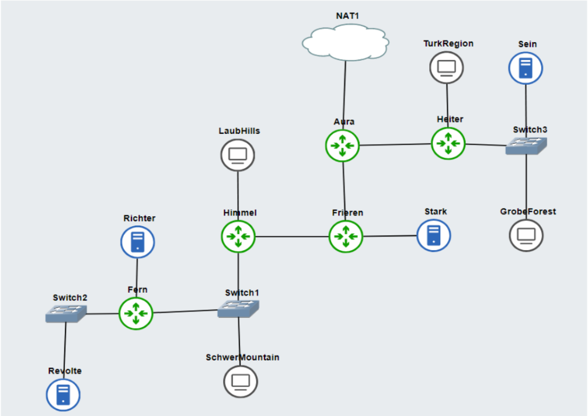

Keterangan:	
- Richter adalah DNS Server
- Revolte adalah DHCP Server
- Sein dan Stark adalah Web Server
- Jumlah Host pada SchwerMountain adalah 64
- Jumlah Host pada LaubHills adalah 255
- Jumlah Host pada TurkRegion adalah 1022
- Jumlah Host pada GrobeForest adalah 512
<br><br>
(B). Untuk menghitung rute-rute yang diperlukan, gunakan perhitungan dengan metode VLSM. Buat juga pohonnya, dan lingkari subnet yang dilewati.<br>
(C). Kemudian buatlah rute sesuai dengan pembagian IP yang kalian lakukan. <br>
(D). Tugas berikutnya adalah memberikan ip pada subnet SchwerMountain, LaubHills, TurkRegion, dan GrobeForest menggunakan bantuan DHCP.<br>


### Penyelesaian
**A.**<br>
Berikut ini adalah topologi yang telah dibuat berdasarkan instruksi soal A-D:
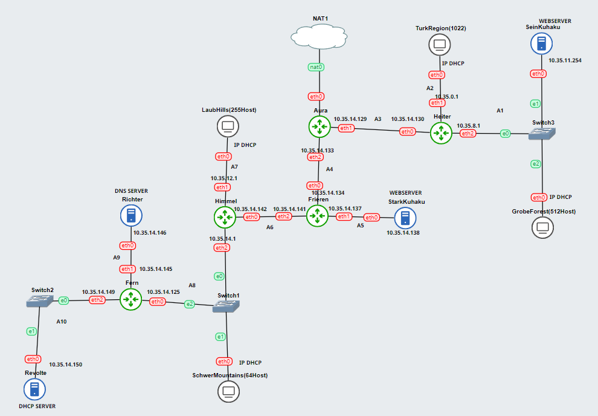<br>

**B.**<br>
Untuk pembagian subnet nya seperti berikut ini:<br>
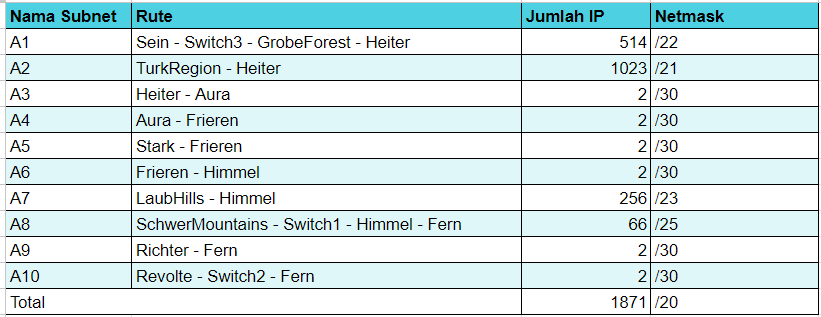
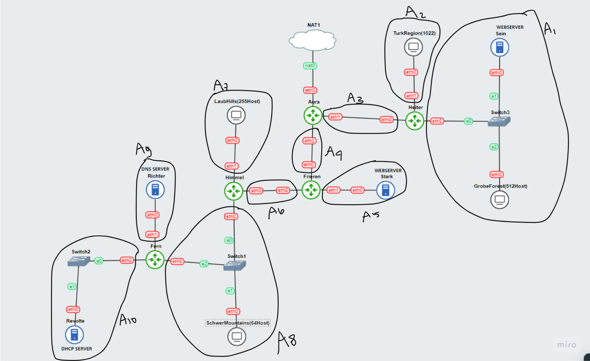<br>

Untuk vlsm tree dapat dilihat di bawah ini:<br>
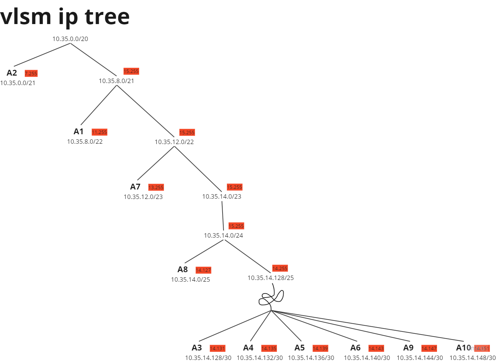<br>

Dan berikut ini adalah pembagian ip yang diperoleh dari tree yang telah dibuat (sudah tertera pada poin A):<br>
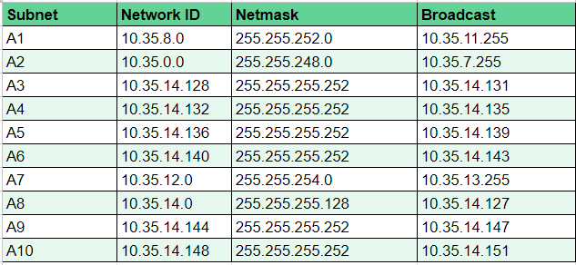

**C.**<br>
Penjelasan tata cara routing dapat dilihat dari lapres saya di [Lapres Modul 4](https://github.com/duevanofairuz/Jarkom-Modul-4-D27-2023). Untuk konfigurasi routing nya akan menjadi seperti ini:
* Node Fern:
```sh
route add -net 0.0.0.0 netmask 0.0.0.0 gw 10.35.14.1 #ip himmel
```
* Node Himmel: 
```sh
route add -net 0.0.0.0 netmask 0.0.0.0 gw 10.35.14.141 #ip frieren
route add -net 10.35.14.144 netmask 255.255.255.252 gw 10.35.14.125 #a9
route add -net 10.35.14.148 netmask 255.255.255.252 gw 10.35.14.125 #a10
```
* Node Frieren:
```sh
route add -net 0.0.0.0 netmask 0.0.0.0 gw 10.35.14.133 #ip aura

route add -net 10.35.12.0 netmask 255.255.254.0 gw 10.35.14.142 #a7
route add -net 10.35.14.0 netmask 255.255.255.128 gw 10.35.14.142 #a8
route add -net 10.35.14.144 netmask 255.255.255.252 gw 10.35.14.142 #a9
route add -net 10.35.14.148 netmask 255.255.255.252 gw 10.35.14.142 #a10
```
* Node Aura:
```sh
route add -net 10.35.8.0 netmask 255.255.252.0 gw 10.35.14.130 #a1
route add -net 10.35.0.0 netmask 255.255.248.0 gw 10.35.14.130 #a2

route add -net 10.35.14.136 netmask 255.255.255.252 gw 10.35.14.134 #a5
route add -net 10.35.14.140 netmask 255.255.255.252 gw 10.35.14.134 #a6
route add -net 10.35.12.0 netmask 255.255.254.0 gw 10.35.14.134 #a7
route add -net 10.35.14.0 netmask 255.255.255.128 gw 10.35.14.134 #a8
route add -net 10.35.14.144 netmask 255.255.255.252 gw 10.35.14.134 #a9
route add -net 10.35.14.148 netmask 255.255.255.252 gw 10.35.14.134 #a10
```
* Node Heiter:
```sh
route add -net 0.0.0.0 netmask 0.0.0.0 gw 10.35.14.129 #ip aura
```

**D.**<br>
Untuk melakukan pembagian IP DHCP kepada host / client, saya membuat konfig DHCP server di node `Revolte`, DHCP relay di node `Himmel` dan `Heiter`. Berikut ini adalah script yang saya pakai:<br>
* DHCP Server (Revolte):<br>
```sh
#!/bin/bash

echo '
INTERFACES="eth0"
' > /etc/default/isc-dhcp-server

echo '
subnet 10.35.8.0 netmask 255.255.252.0 {
    range 10.35.8.2 10.35.11.253;
    option routers 10.35.8.1;
    option broadcast-address 10.35.11.255;
    min-lease-time 2400;
    default-lease-time 2400;
    max-lease-time 5760;
}
subnet 10.35.0.0 netmask 255.255.248.0 {
    range 10.35.0.2 10.35.7.254;
    option routers 10.35.0.1;
    option broadcast-address 10.35.7.255;
    min-lease-time 2400;
    default-lease-time 2400;
    max-lease-time 5760;
}

subnet 10.35.14.128 netmask 255.255.255.252 {
}
subnet 10.35.14.132 netmask 255.255.255.252 {
}
subnet 10.35.14.136 netmask 255.255.255.252 {
}
subnet 10.35.14.140 netmask 255.255.255.252 {
}

subnet 10.35.12.0 netmask 255.255.254.0 {
    range 10.35.12.2 10.35.13.254;
    option routers 10.35.12.1;
    option broadcast-address 10.35.13.255;
    min-lease-time 2400;
    default-lease-time 2400;
    max-lease-time 5760;
}
subnet 10.35.14.0 netmask 255.255.255.128 {
    range 10.35.14.2 10.35.14.126;
    option routers 10.35.14.1;
    option broadcast-address 10.35.14.127;
    min-lease-time 2400;
    default-lease-time 2400;
    max-lease-time 5760;
}

subnet 10.35.14.144 netmask 255.255.255.252 {
}
subnet 10.35.14.148 netmask 255.255.255.252 {
}
' > /etc/dhcp/dhcpd.conf

service isc-dhcp-server restart
```

* DHCP Relay (Himmel & Heiter):<br>
```sh
#!/bin/bash

echo '
SERVERS="10.35.14.150"  
INTERFACES="eth0 eth1 eth2"
OPTIONS=
' > /etc/default/isc-dhcp-relay

echo '
net.ipv4.ip_forward=1
' > /etc/sysctl.conf

service isc-dhcp-relay restart
```

### Output
Berikut ini adalah contoh output bahwa setiap host sudah bisa menerima IP secara dinamis:<br>
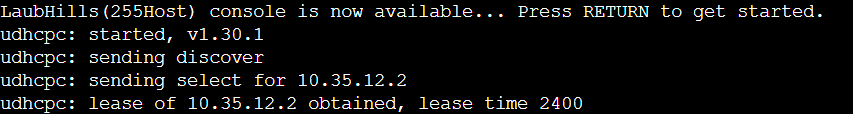<br>
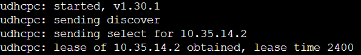<br>
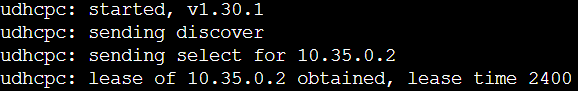<br>
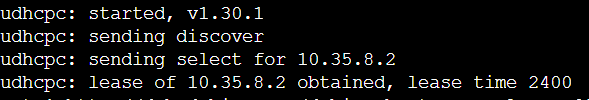<br>

Dan berikut ini adalah bukti bahwa routing dan subnetting telah berjalan dengan baik:
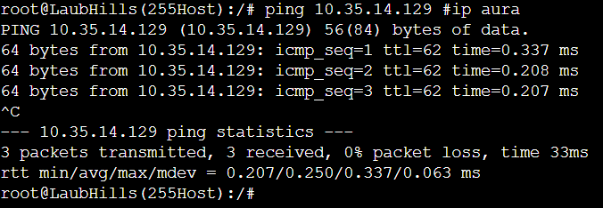<br>
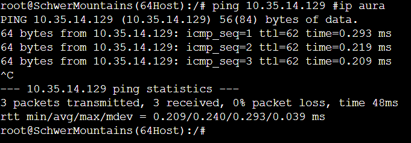<br>
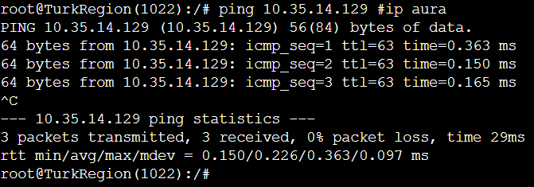<br>
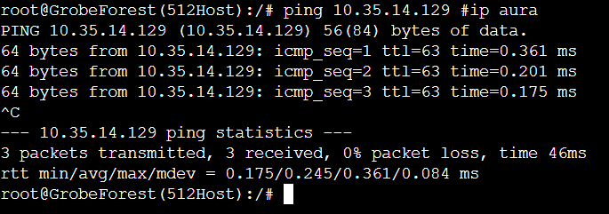<br>


### Kendala:

----------------------------------------------------------------------------------------------------------------------------------
# No. 1
### Soal
Agar topologi yang kalian buat dapat mengakses keluar, kalian diminta untuk mengkonfigurasi Aura menggunakan iptables, tetapi tidak ingin menggunakan MASQUERADE.

### Penyelesaian
Agar semua node bisa mengakses keluar (internet), saya melakukan konfigurasi di router aura dengan cara memakai ip static dan iptables nat tables sebagai berikut:
```sh
auto eth0
iface eth0 inet static
        address 192.168.122.2
        netmask 255.255.255.252
        gateway 192.168.122.1
```
* disini router aura di interface `eth0`(yang mengarah ke NAT) juga memiliki gateway dengan ip yang umumnya dipakai yakni `192.168.122.1`
* sedangkan ip aura di `eth0` sendiri menggunakan `192.168.122.2` dengan netmask /30
* konfigurasi ini dilakukan agar iptables nantinya dapat bekerja

sedangkan berikut ini adalah konfig dari iptables nya:
```sh
iptables -t nat -A POSTROUTING -o eth0 -j SNAT --to-source 192.168.122.2 -s 10.35.0.0/20
```
* menambahkan aturan `SNAT` pada chain `POSTROUTING` di tabel `nat`.
* mengganti alamat sumber (SNAT) dari paket yang berasal dari jaringan `10.35.0.0/20` menjadi `192.168.122.2` saat melewati antarmuka `eth0`.
* tak lupa setelah aura terkonfigurasi, semua node perlu menambahkan `nameserver 192.168.122.1` menggunakan command berikut: `echo 'nameserver 192.168.122.1' > /etc/resolv.conf`

### Output
Berikut ini adalah contoh output dari beberapa node terjauh di topologi:
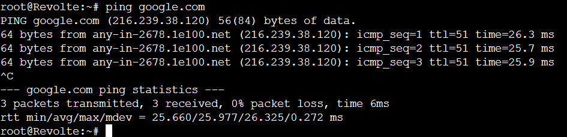<br>
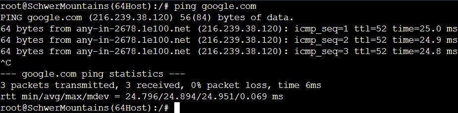<br>
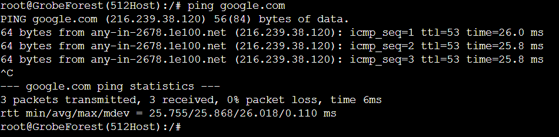<br>


### Kendala:

----------------------------------------------------------------------------------------------------------------------------------
# No. 2
### Soal
Kalian diminta untuk melakukan drop semua TCP dan UDP kecuali port 8080 pada TCP.

### Penyelesaian
Disini saya menggunakan node GrobeForest sebagai contohnya. Berikut ini adalah rules iptables nya:
```sh
#!/bin/bash

iptables -A INPUT -p tcp --dport 8080 -j ACCEPT

iptables -A INPUT -p tcp -j DROP
iptables -A INPUT -p udp -j DROP
```
```iptables -A INPUT -p tcp --dport 8080 -j ACCEPT```
* -A INPUT: Menambahkan aturan pada chain INPUT.
* -p tcp: Menentukan protokol TCP.
* --dport 8080: Menentukan port tujuan 8080.
* -j ACCEPT: Mengizinkan paket.

```iptables -A INPUT -p tcp -j DROP```
* -A INPUT: Menambahkan aturan pada chain INPUT.
* -p tcp: Menentukan protokol TCP.
* -j DROP: Menolak (drop) paket.

```iptables -A INPUT -p udp -j DROP```
* -A INPUT: Menambahkan aturan pada chain INPUT.
* -p udp: Menentukan protokol UDP.
* -j DROP: Menolak (drop) paket.

### Output
Untuk pengetesan bisa dilakukan dengan cara <br>
(1) membuka netcat dengan command `nc -lvp [port]` di GrobeForest, dan `nc [ipGrobe] [port]` di node yang ingin mengakses grobe.<br> (2) atau bisa juga dengan cara `nc -lvp [port]` di GrobeForest dan `nmap -p [port] [ipgrobe]` di node yang ingin mengakses.<br>
disini saya akan mencontohkan menggunakan cara kedua:
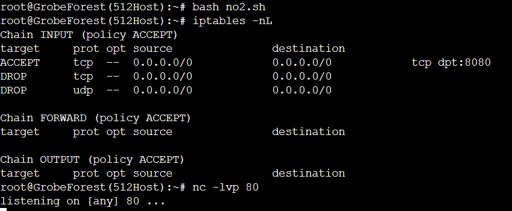<br>
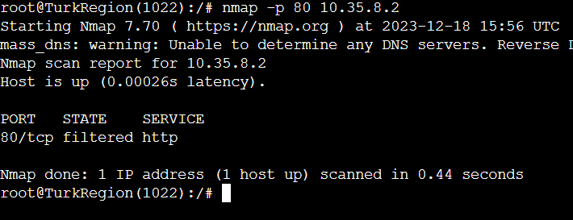<br>
* bisa dilihat, contoh di atas adalah ketika menggunakan koneksi tcp dengan port 80
* di node pengetes mendapat pesan state `filtered` yang mana menandakan firewall berhasil melakukan block

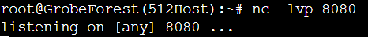<br>
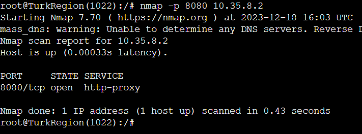<br>
* bisa dilihat, contoh di atas adalah ketika menggunakan koneksi tcp dengan port 8080
* di node pengetes mendapat pesan state `open` yang mana menandakan firewall berhasil melakukan filtering

### Kendala:

----------------------------------------------------------------------------------------------------------------------------------
# No. 3
### Soal
Kepala Suku North Area meminta kalian untuk membatasi DHCP dan DNS Server hanya dapat dilakukan ping oleh maksimal 3 device secara bersamaan, selebihnya akan di drop.

### Penyelesaian
Berikut ini adalah script yang digunakan untuk menulis rule yang dipakai di `revolte` dan `richter`:
```sh
#!/bin/bash

# agar ping di 3 node pertama terus berjalan meskipun ada node keempat yang interupsi
iptables -A INPUT -m state --state ESTABLISHED,RELATED -j ACCEPT

#membatasi 3 node saja yang bisa ping secara bersamaan
iptables -A INPUT -p icmp -m connlimit --connlimit-above 4 --connlimit-mask 0 -j DROP
```
`iptables -A INPUT -m state --state ESTABLISHED,RELATED -j ACCEPT`
* menambahkan aturan pada chain INPUT.
* mengizinkan paket yang merupakan bagian dari koneksi yang sudah terbentuk atau terkait.

`iptables -A INPUT -p icmp -m connlimit --connlimit-above 4 --connlimit-mask 0 -j DROP`
* menambahkan aturan pada chain INPUT.
* memeriksa paket ICMP (ping).
* menggunakan modul connlimit untuk membatasi jumlah koneksi ping.
* --connlimit-above 4: Membatasi jumlah koneksi ping di atas 4.
* --connlimit-mask 0: Tidak ada mask yang diterapkan, sehingga membatasi berdasarkan alamat IP sumber.
* -j DROP: Menolak (drop) paket jika jumlah koneksi melebihi batas yang ditentukan.

### Output
Berikut ini adalah contoh output menggunakan cara ping:
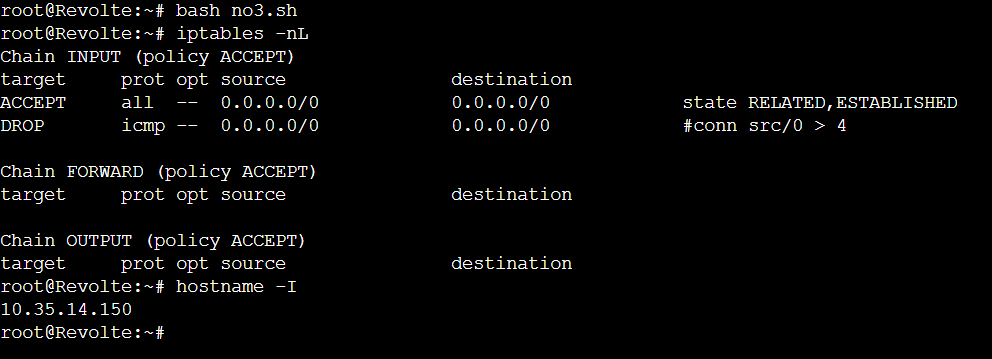
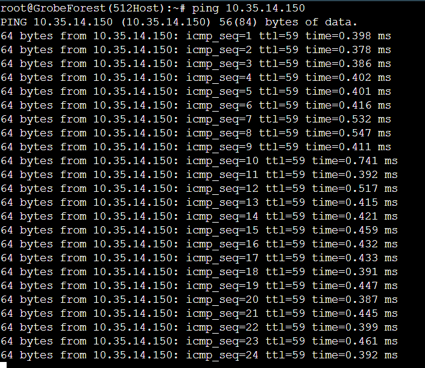
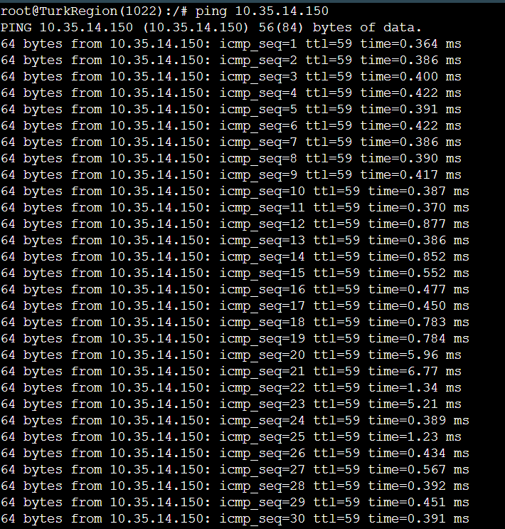
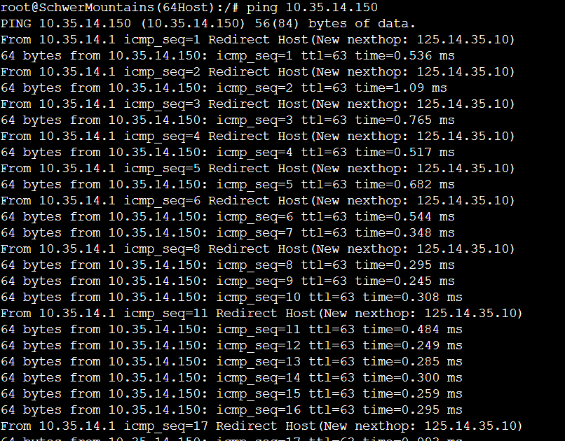<br>
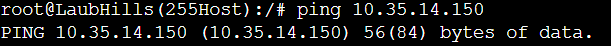<br>
* dapat dilihat bahwa node keempat yang melakukan ping akan otomatis di drop dan tidak mendapatkan balasan dari `revolte`

### Kendala:
* terkadang ping bermasalah jika dilakukan oleh router
* terkadang semua ping berhenti karena adanya node keempat yang melakukan ping

----------------------------------------------------------------------------------------------------------------------------------
# No. 4
### Soal
Lakukan pembatasan sehingga koneksi SSH pada Web Server hanya dapat dilakukan oleh masyarakat yang berada pada GrobeForest.

### Penyelesaian
Berikut ini adalah script yang digunakan untuk menerapkan firewall di node Web Server yakni Sein dan Stark:
```sh
#!/bin/bash

iptables -A INPUT -p tcp --dport 22 -m iprange --src-range 10.35.8.2-10.35.11.253 -j ACCEPT
iptables -A INPUT -p tcp --dport 22 -j DROP
```
* menambahkan aturan pada chain INPUT.
* mengizinkan paket TCP dengan tujuan port 22 (SSH).
* hanya mengizinkan koneksi SSH dari rentang alamat IP 10.35.8.2 hingga 10.35.11.253 (ip range subnet grobeforest).
* menambahkan aturan pada chain INPUT.
* menolak (drop) semua paket TCP dengan tujuan port 22 yang tidak sesuai dengan aturan sebelumnya.

### Output
pengetesan dilakukan dengan cara `nc -lvp [port]` di Sein / Stark dan `nmap -p [port] [ip]` di node yang ingin mengakses
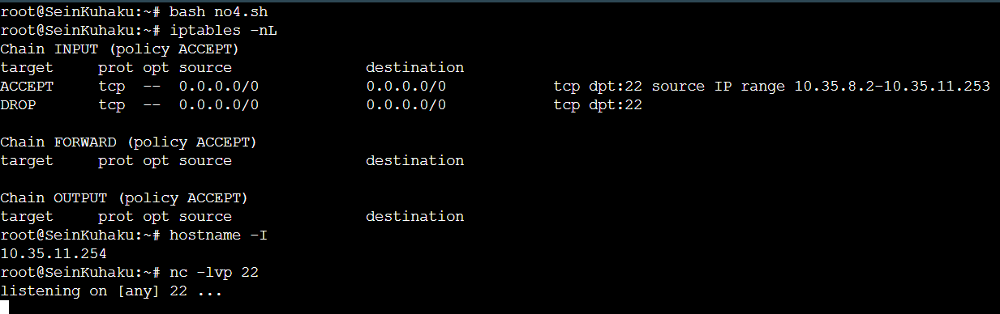<br>
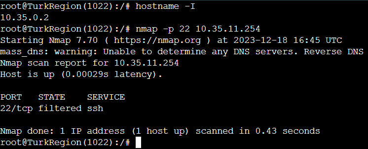<br>
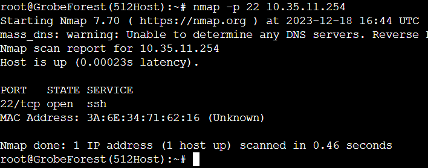<br>
* dapat dilihat bahwa grobeforest bisa melakukan akses sedangkan turkregion tidak

### Kendala:

----------------------------------------------------------------------------------------------------------------------------------
# No. 5
### Soal
Selain itu, akses menuju WebServer hanya diperbolehkan saat jam kerja yaitu Senin-Jumat pada pukul 08.00-16.00.

### Penyelesaian
Berikut ini adalah script yang berisi rules untuk mengatur akses pada jam tertentu di webserver (sein & stark):
```sh
#!/bin/bash

iptables -F

iptables -A INPUT -p tcp --dport 22 -m iprange --src-range 10.35.8.2-10.35.11.253 -m time --timestart 08:00 --timestop 16:00 --weekdays Mon,Tue,Wed,Thu,Fri -j ACCEPT

iptables -A INPUT -p tcp --dport 22 -j DROP
```
* membersihkan (flush) semua aturan yang ada pada iptables.
* menambahkan aturan pada chain INPUT.
* mengizinkan paket TCP dengan tujuan port 22 (SSH).
* hanya mengizinkan koneksi SSH dari rentang alamat IP 10.35.8.2 hingga 10.35.11.253.
* menerapkan batasan waktu pada aturan: izinkan hanya pada hari Senin hingga Jumat dari pukul 08:00 hingga 16:00.
* menambahkan aturan pada chain INPUT.
* menolak (drop) semua paket TCP dengan tujuan port 22 yang tidak sesuai dengan aturan sebelumnya.
* script ini melakukan overwrite dari script di nomor 4 jadi saya lakukan flush lalu concatenate filter baru nya

### Output
Pengetesan juga bisa dilakukan dengan nmap seperti sebelumnya:
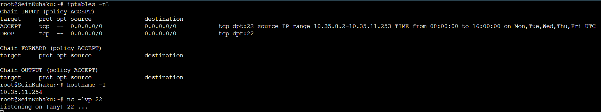<br>
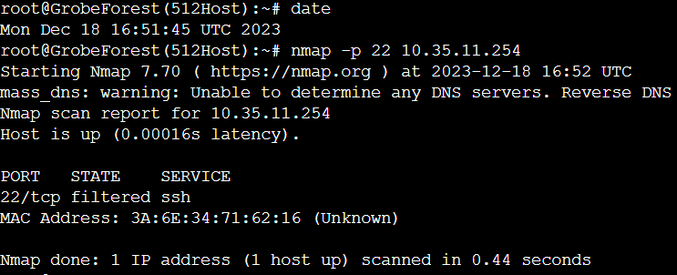<br>
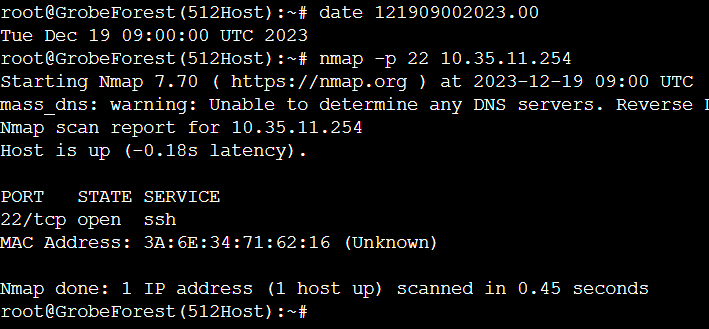<br>

### Kendala:

----------------------------------------------------------------------------------------------------------------------------------
# No. 6
### Soal
Lalu, karena ternyata terdapat beberapa waktu di mana network administrator dari WebServer tidak bisa stand by, sehingga perlu ditambahkan rule bahwa akses pada hari Senin - Kamis pada jam 12.00 - 13.00 dilarang (istirahat maksi cuy) dan akses di hari Jumat pada jam 11.00 - 13.00 juga dilarang (maklum, Jumatan rek).

### Penyelesaian
Sama seperti sebelumnya, saya juga melakukan overwrite dan concatenate dari script yang ada di nomor 5, ini dilakukan agar konfig firewall sebelumnya tetap bekerja. Berikut ini adalah script yang digunakan untuk menerapkan rules di web server (sein & stark):
```sh
#!/bin/bash

iptables -F

#drop di jam 12-13 mon-thu
iptables -A INPUT -p tcp --dport 22 -m iprange --src-range 10.35.8.2-10.35.11.253 -m time --timestart 12:00 --timestop 13:00 --weekdays Mon,Tue,Wed,Thu -j DROP

#drop di jam 11-13 fri
iptables -A INPUT -p tcp --dport 22 -m iprange --src-range 10.35.8.2-10.35.11.253 -m time --timestart 11:00 --timestop 13:00 --weekdays Fri -j DROP

iptables -A INPUT -p tcp --dport 22 -m iprange --src-range 10.35.8.2-10.35.11.253 -m time --timestart 08:00 --timestop 16:00 --weekdays Mon,Tue,Wed,Thu,Fri -j ACCEPT

iptables -A INPUT -p tcp --dport 22 -j DROP
```
* menambahkan aturan pada chain INPUT.
* menolak (drop) koneksi SSH pada port 22 dari rentang alamat IP 10.35.8.2 hingga 10.35.11.253 pada hari Senin hingga Kamis antara pukul 12:00 hingga 13:00.
* menambahkan aturan pada chain INPUT.
* menolak (drop) koneksi SSH pada port 22 dari rentang alamat IP 10.35.8.2 hingga 10.35.11.253 pada hari Jumat antara pukul 11:00 hingga 13:00.
* sisa script sama seperti sebelumnya

### Output
Pengetesan juga dilakukan menggunakan nmap
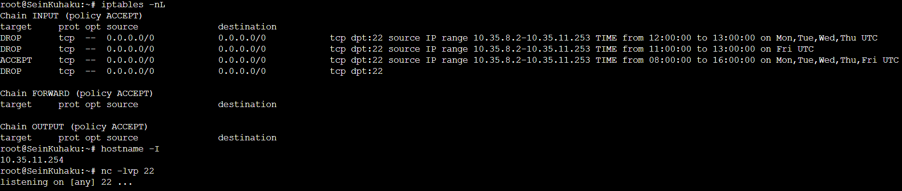<br>
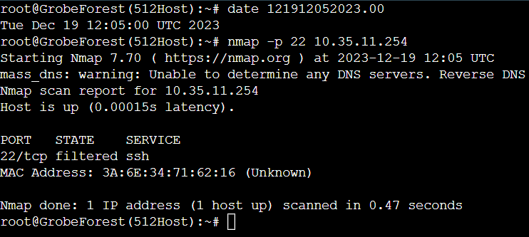<br>
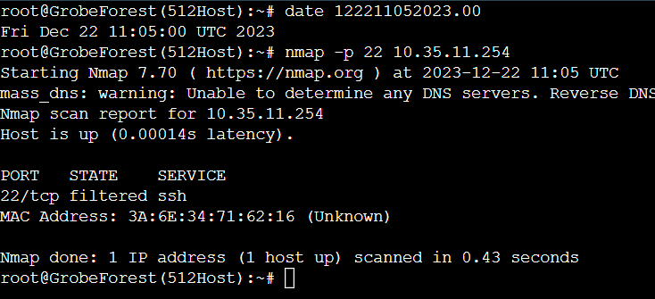<br>
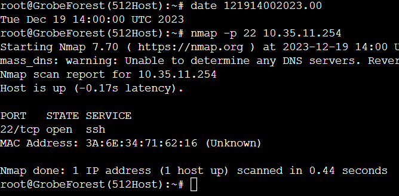<br>


### Kendala:

----------------------------------------------------------------------------------------------------------------------------------
# No. 7
### Soal
Karena terdapat 2 WebServer, kalian diminta agar setiap client yang mengakses Sein dengan Port 80 akan didistribusikan secara bergantian pada Sein dan Stark secara berurutan dan request dari client yang mengakses Stark dengan port 443 akan didistribusikan secara bergantian pada Sein dan Stark secara berurutan.

### Penyelesaian
Berikut ini adalah script yang digunakan oleh router penengah sein dan stark yaitu heiter:
```sh
#!/bin/bash

#iptables -A PREROUTING -t nat -p tcp --dport 80 -d 10.35.11.254 -m statistic --mode nth --every 2 --packet 0 -j DNAT --to-destination 10.35.14.138:80
#iptables -A PREROUTING -t nat -p tcp --dport 80 -d 10.32.11.254 -m statistic --mode nth --every 1 --packet 0 -j DNAT --to-destination 10.35.11.254:80

iptables -A PREROUTING -t nat -p tcp --dport 80 -d 10.35.11.254 -m statistic --mode nth --every 2 --packet 0 -j DNAT --to-destination 10.35.11.254

iptables -A PREROUTING -t nat -p tcp --dport 80 -d 10.35.11.254 -j DNAT --to-destination 10.35.14.138

iptables -A PREROUTING -t nat -p tcp --dport 443 -d 10.35.14.138 -m statistic --mode nth --every 2 --packet 0 -j DNAT --to-destination 10.35.14.138

iptables -A PREROUTING -t nat -p tcp --dport 443 -d 10.35.14.138 -j DNAT --to-destination 10.35.11.254
```
`iptables -A PREROUTING -t nat -p tcp --dport 80 -d 10.35.11.254 -m statistic --mode nth --every 2 --packet 0 -j DNAT --to-destination 10.35.11.254`
* menambahkan aturan pada chain PREROUTING di tabel nat.
* mengarahkan (DNAT) lalu lintas TCP dengan tujuan port 80 ke host 10.35.11.254.
* menggunakan statistik untuk menerapkan modus nth, mengarahkan setiap kedua paket (every 2).

`iptables -A PREROUTING -t nat -p tcp --dport 80 -d 10.35.11.254 -j DNAT --to-destination 10.35.14.138`
* menambahkan aturan pada chain PREROUTING di tabel nat.
* mengarahkan (DNAT) lalu lintas TCP dengan tujuan port 80 ke host 10.35.14.138 jika bukan setiap kedua paket.

`iptables -A PREROUTING -t nat -p tcp --dport 443 -d 10.35.14.138 -m statistic --mode nth --every 2 --packet 0 -j DNAT --to-destination 10.35.14.138`
* menambahkan aturan pada chain PREROUTING di tabel nat.
* mengarahkan (DNAT) lalu lintas TCP dengan tujuan port 443 ke host 10.35.14.138 hanya pada setiap kedua paket.

`iptables -A PREROUTING -t nat -p tcp --dport 443 -d 10.35.14.138 -j DNAT --to-destination 10.35.11.254`
* menambahkan aturan pada chain PREROUTING di tabel nat.
* mengarahkan (DNAT) lalu lintas TCP dengan tujuan port 443 ke host 10.35.11.254 jika bukan setiap kedua paket.

### Output
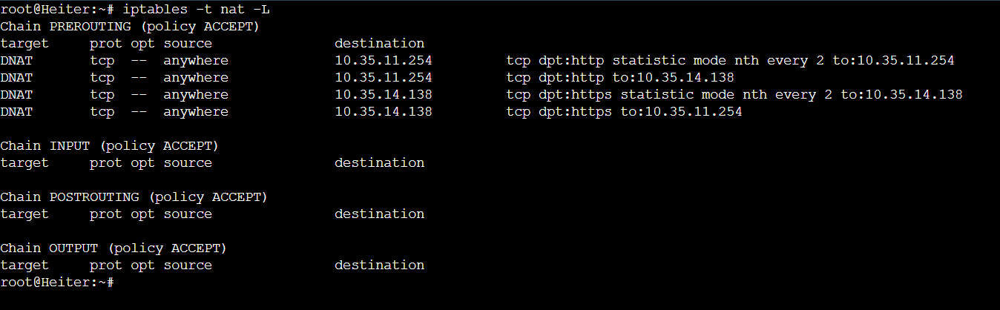<br>

pengetesan bisa dilakukan melalui node `turkregion` dan `heiter` dengan cara berikut:
**port 80**<br>
* node sein: `while true; do nc -l -p 80 -c 'echo "halo dari sein"'; done`
* node stark: `while true; do nc -l -p 80 -c 'echo "halo dari stark"'; done`
* node pengakses: nc [ip] 80

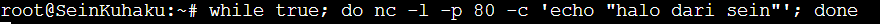<br>
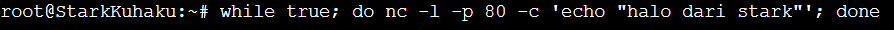<br>
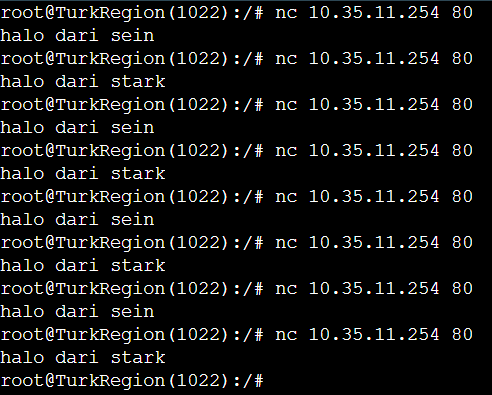<br>

**port 443**<br>
* node sein: `while true; do nc -l -p 443 -c 'echo "halo dari sein"'; done`
* node stark: `while true; do nc -l -p 443 -c 'echo "halo dari stark"'; done`
* node pengakses: nc [ip] 443

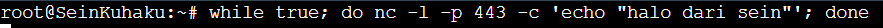<br>
<br>
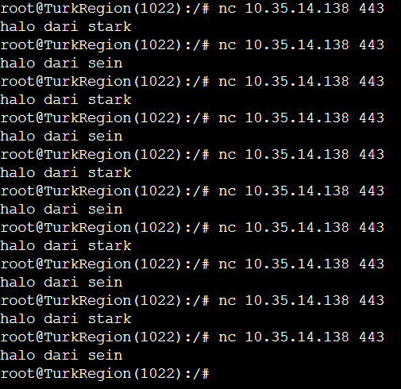<br>

### Kendala:

----------------------------------------------------------------------------------------------------------------------------------
# No. 8
### Soal
Karena berbeda koalisi politik, maka subnet dengan masyarakat yang berada pada Revolte dilarang keras mengakses WebServer hingga masa pencoblosan pemilu kepala suku 2024 berakhir. Masa pemilu (hingga pemungutan dan penghitungan suara selesai) kepala suku bersamaan dengan masa pemilu Presiden dan Wakil Presiden Indonesia 2024.

### Penyelesaian
Berikut ini adalah script dari web server:
```sh
#!/bin/bash

iptables -F

#drop di jam 12-13 mon-thu
iptables -A INPUT -p tcp --dport 22 -m iprange --src-range 10.35.8.2-10.35.11.253 -m time --timestart 12:00 --timestop 13:00 --weekdays Mon,Tue,Wed,Thu -j DROP

#drop di jam 11-13 fri
iptables -A INPUT -p tcp --dport 22 -m iprange --src-range 10.35.8.2-10.35.11.253 -m time --timestart 11:00 --timestop 13:00 --weekdays Fri -j DROP

#drop revolte di masa pemilu
iptables -A INPUT -p tcp --dport 80 -s 10.35.14.150 -m time --datestart 2023-10-19T00:00:00 --datestop 2024-02-15T23:59:59 -j DROP

iptables -A INPUT -p tcp --dport 22 -m iprange --src-range 10.35.8.2-10.35.11.253 -m time --timestart 08:00 --timestop 16:00 --weekdays Mon,Tue,Wed,Thu,Fri -j ACCEPT

iptables -A INPUT -p tcp --dport 22 -j DROP
```
* disini saya mengambil tanggal habis masa pemilu pada tanggal 15 Februari 2024 yang mana menunjukkan selesainya fase pemungutan dan perhitungan suara.
* menambahkan aturan pada chain INPUT di tabel filter.
* menolak (DROP) koneksi TCP dengan tujuan port 80 dari sumber IP 10.35.14.150.
* menggunakan modul waktu (-m time) untuk menerapkan aturan hanya pada periode mulai dari tanggal 19 Oktober 2023 pukul 00:00:00 hingga tanggal 15 Februari 2024 pukul 23:59:59.


### Output
Pengetesan dilakukan menggunakan nmap seperti sebelumnya dan akses-nya dilakukan dari revolte menggunakan port 80
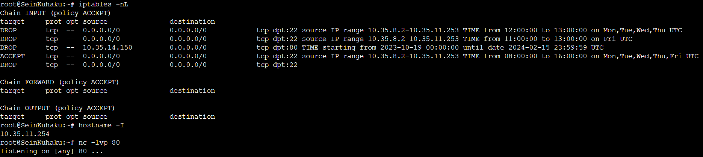<br>
<br>
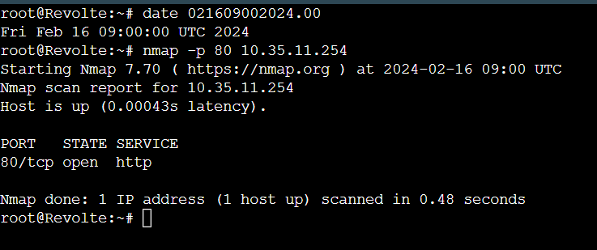<br>


### Kendala:

----------------------------------------------------------------------------------------------------------------------------------
# No. 9
### Soal


### Penyelesaian


### Output


### Kendala:

----------------------------------------------------------------------------------------------------------------------------------
# No. 10
### Soal


### Penyelesaian


### Output


### Kendala:

----------------------------------------------------------------------------------------------------------------------------------